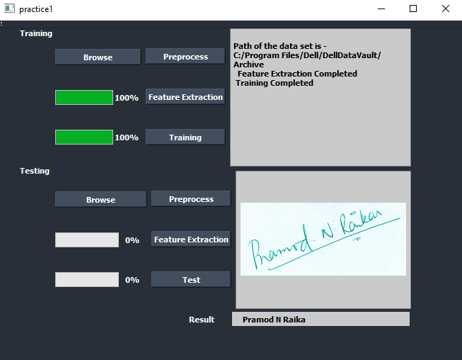

# Signature-Recognition
Signature Recognition using **SVM (Support Vector Machine)** and **HOG (Histogram of Oriented Gradients)** in C++ using opencv library and Qt for GUI. 

Project is divided in 3 parts- 

1. Item Preprocessing on training singature samples.

2. Item Feature Extraction using HOG descriptor. 

3. Item Classification using SVM.

4. Item Matching of test signature with training sample images.

Screenshot of GUI

